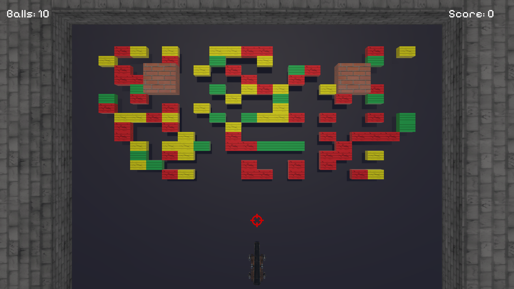
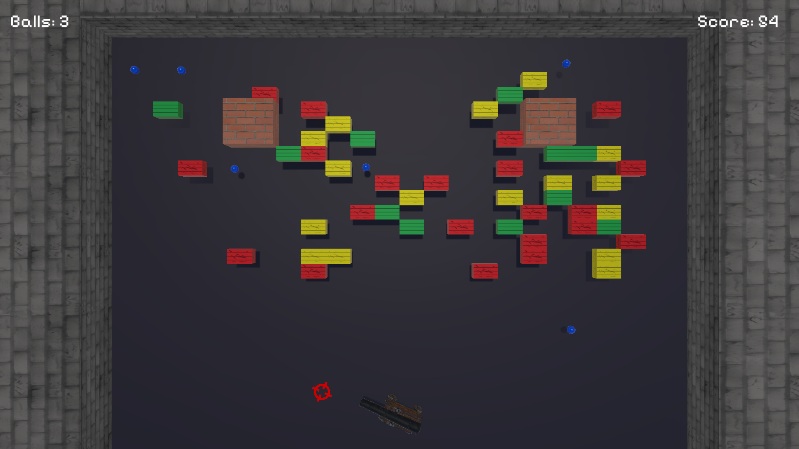
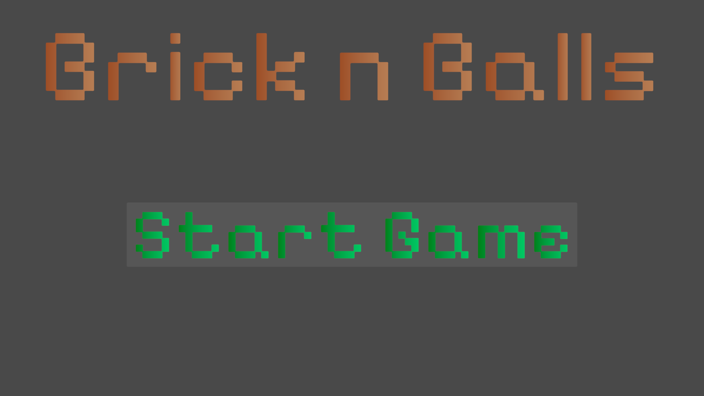
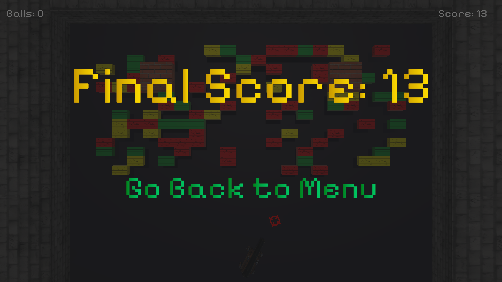

# BrickNBalls

Breakout inspired game built with **Unity DOTS**.

* **Core:** Unity ECS, C# Job System, Burst Compiler.
* **physics:** Unity Physics.
* **Render:** Hybrid (Entities + Gameobjects).

## Controls
* **A / D:** Aim
* **Space:** Shoot

Made in Unity 6000.0.63f1.

